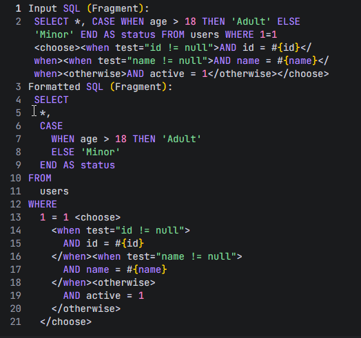

# MyBatis SQL Formatter

[English](./README.md) | [简体中文](./README.zh-cn.md)

一个用于格式化 MyBatis XML 文件和包含 MyBatis 动态标签的 SQL 片段的 VS Code 扩展。

## 功能特性 (Features)

- **格式化 MyBatis XML**: 正确格式化 `<mapper>`, `<select>`, `<insert>`, `<update>`, `<delete>` 等 MyBatis 标签，并保持正确的缩进。
- **格式化 SQL 片段**: 支持直接格式化混合了 MyBatis 动态标签（如 `<if>`, `<choose>`, `<where>`, `<foreach>`）的原始 SQL 片段，无需 XML 根元素包裹。
- **SQL 缩进**: 在保留 MyBatis 标签结构的同时，使用标准 SQL 格式化规则对标签内的 SQL 内容进行格式化。

## 使用方法 (Usage)

1. 打开一个 MyBatis XML 文件 (`.xml`) 或包含 MyBatis SQL 的文件 (`.sql`)。
2. 运行 **Format Document** 命令（Windows 上为 `Shift+Alt+F`）或右键点击选择 **格式化文档**。
3. 或者使用专用命令 **Format MyBatis SQL** 或快捷键：
   - Windows: `Ctrl+Win+F`
   - Mac: `Ctrl+Cmd+F`
   - Linux: `Ctrl+Meta+F`

